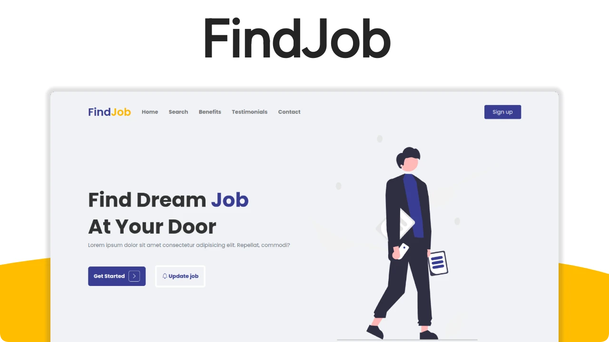

<p align="center">
    <a href="https://getbootstrap.com/docs/5.2/getting-started/introduction/">
        
    </a>
    
    <a href="https://github.com/migueweb/FindJob/blob/main/LICENSE">
        
    </a>
</p>

# FindJob

Beautiful and modern responsive landing page build with bootstrap and AOS.

## Features

- 100% Mobile adaptive 📱
- animations with AOS
- Bootstrap 5
- Semantic HTML 🤓

## Build with

- HTML
- SCSS
- Bootstrap v5.2
- bootstrap icons
- AOS

## Requirements

- [NPM](https://nodejs.org/en/download)

## Deveploment

```bash
git clone https://migueweb/Findjob
cd Findjob
npm install
npm run dev
```

## Production

```bash
npm run build
```

## 🤝 Contributing

Hey if you want to add more documentation, improve the code or report issues, you are welcome. Please see 😉👉 [contributing.md](CONTRIBUTING.md) for details.

## Author

- Github: [@migueweb](https://github.com/migueweb)
